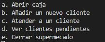

# Guía para Usuarios

## Saludos usuario

Si has llegado hasta aquí es porque necesitas algo de ayuda para usar tu nueva pokédex, como profesor pokémon que soy te aseguro que para el final de esta guía sabrás usar esta pokédex a la perfección.

Al entrar has debido de ver el siguiente menú, muy bien dejame explicarte la función de cada opción:

**Opcion a:** Esta función abre la caja que atiende el cajero, es necesario usa primero esta opción para usar el resto de las funciones.

**Opción b:** Está función genera un cliente aleatorio, muestra por pantalla sus datos y lo añade a la cola.

**Opción c:** Esta opción muestra al usuario que se atien por pantalla y lo elimina de la cola.

**Opción d:** Con esta opción se podrán ver los datos de los clientes que aún no han sido atendidos.

**Opción e:** Esta opción cerrará la caja si esta se encontraba abierta y cerrara la aplicación.

Si desea volver al readme pulse [aquí](../README.md)